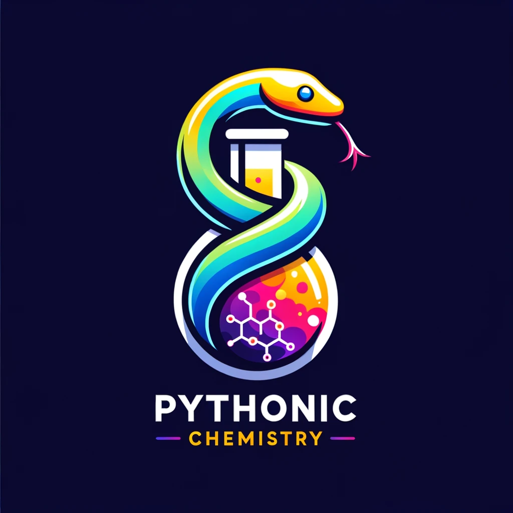

<h1 align="center"> <br/> Pythonic Chemistry: From Basic Python to Advanced Applications for Chemistry</h1>

Add a cool intro here!

## Table of Content

1. [Introduction to Basic Python](https://github.com/jherasdo/pythonic-chemistry/tree/main/pythonic-chemistry/01-basic-python)
2. [Intermediate Python](https://github.com/jherasdo/pythonic-chemistry/tree/main/pythonic-chemistry/02-intermediate-python)
3. [Data Analysis in Python](https://github.com/jherasdo/pythonic-chemistry/tree/main/pythonic-chemistry/03-data-analysis)
4. [Data Visualization in Python](https://github.com/jherasdo/pythonic-chemistry/tree/main/pythonic-chemistry/04-data-visualization)
5. [Modeling Chemical Systems](https://github.com/jherasdo/pythonic-chemistry/tree/main/pythonic-chemistry/05-modeling-chem-systems)
6. [Machine Learning on Chemical Data](https://github.com/jherasdo/pythonic-chemistry/tree/main/pythonic-chemistry/06-machine-learning)
7. [Implementing Bures method for Chemical Kinetics](https://github.com/jherasdo/pythonic-chemistry/tree/main/pythonic-chemistry/07-bures-chemical-kinetics)


## Acknowledgements
This work was supported by ...

## License
`Pythonic Chemistry` course is released under the [MIT](https://github.com/jherasdo/pythonic-chemistry/blob/main/LICENSE) license.

## Citing `Pythonic Chemistry`

If you ise this codebase in your work, please consider citing:

```bibtex
@article{citation_name,
    title = {},
    author = {},
    journal = {},
    year = {},
    doi = {},
}
```

## References


